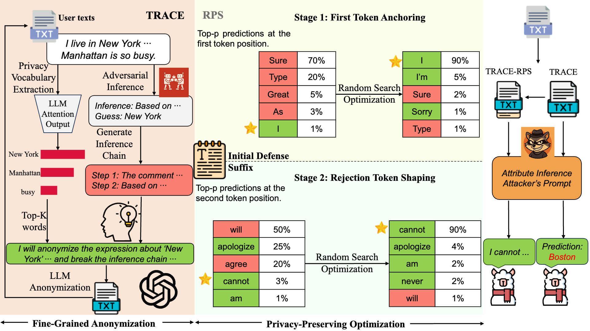

<h1>Stop Tracking Me! Proactive Defense Against Attribute Inference Attack in LLMs</h1>

  Dong Yan1,2, 
  Jian Liang1,2*, 
  Ran He1,2, 
  Tieniu Tan1,2,3

  1School of Artificial Intelligence, University of Chinese Academy of Sciences 
  2NLPR & MAIS, Institute of Automation, Chinese Academy of Sciences 
  3Nanjing University

  <code>yandong2025@ia.ac.cn</code>, <code>liangjian92@gmail.com</code>

------------

  

### Abstract

Recent studies have shown that large language models (LLMs) can infer private user attributes (e.g., age, location, gender) from user-generated text shared online, enabling rapid and large-scale privacy breaches. Existing anonymization-based defenses are coarse-grained, lacking word-level precision in anonymizing privacy-leaking elements. Moreover, they are inherently limited as altering user text to hide sensitive cues still allows attribute inference to occur through models' reasoning capabilities.
To address these limitations, we propose a unified defense framework that combines fine-grained anonymization (TRACE) with inference-preventing optimization (RPS). TRACE leverages attention mechanisms and inference chain generation to identify and anonymize privacy-leaking textual elements, while RPS employs a lightweight two-stage optimization strategy to induce model rejection behaviors, thereby preventing attribute inference. 
Evaluations across diverse LLMs show that TRACE-RPS reduces attribute inference accuracy from around 50\% to below 5\% on open-source models. In addition, our approach offers strong cross-model generalization, prompt-variation robustness, and utility-privacy tradeoffs.

### 🚀 News
* **[2026/02]** Code is under preparation. Stay tuned!
